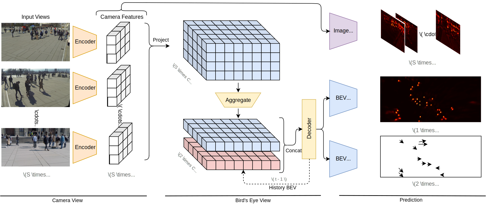

# TrackTacular :octopus:

**Lifting Multi-View Detection and Tracking to the Bird’s Eye View**

[Torben Teepe](https://github.com/tteepe),
[Philipp Wolters](https://github.com/phi-wol),
[Johannes Gilg](https://github.com/Blueblue4),
[Fabian Herzog](https://github.com/fubel),
Gerhard Rigoll

[](https://arxiv.org/abs/2403.12573)

[](https://paperswithcode.com/sota/multi-object-tracking-on-wildtrack?p=lifting-multi-view-detection-and-tracking-to)
[](https://paperswithcode.com/sota/multi-object-tracking-on-multiviewx?p=lifting-multi-view-detection-and-tracking-to)
[](https://paperswithcode.com/sota/multiview-detection-on-multiviewx?p=lifting-multi-view-detection-and-tracking-to)

> [!TIP]
> This work is an extension of your previous work [EarlyBird  🦅](https://github.com/tteepe/EarlyBird).
> Feel free to check it out and extend our multi-view object detection and tracking pipeline on other datasets!



## Usage

### Getting Started
1. Install [PyTorch](https://pytorch.org/get-started/locally/) with CUDA support
    ```shell
   pip3 install torch torchvision --index-url https://download.pytorch.org/whl/cu118
   ```
2. Install [mmcv](https://mmcv.readthedocs.io/en/latest/get_started/installation.html#install-with-pip) with CUDA support
   ```shell
   pip install mmcv==2.0.0 -f https://download.openmmlab.com/mmcv/dist/cu118/torch2.1/index.html
   ```
3. Install remaining dependencies
   ```shell
   pip install -r requirements.txt
   ```

### Training
```shell
python world_track.py fit -c configs/t_fit.yml \
    -c configs/d_{multiviewx,wildtrack,synthehicle}.yml \
    -c configs/m_{mvdet,segnet,liftnet,bevformer}.yml
```
### Testing
```shell
python world_track.py test -c model_weights/config.yaml \
    --ckpt model_weights/model-epoch=35-val_loss=6.50.ckpt
```

## Acknowledgement
- [Simple-BEV](https://simple-bev.github.io): Adam W. Harley
- [MVDeTr](https://github.com/hou-yz/MVDeTr): Yunzhong Hou

## Citation
```bibtex
@article{teepe2023lifting,
      title={Lifting Multi-View Detection and Tracking to the Bird's Eye View}, 
      author={Torben Teepe and Philipp Wolters and Johannes Gilg and Fabian Herzog and Gerhard Rigoll},
      year={2024},
      eprint={2403.12573},
      archivePrefix={arXiv},
      primaryClass={cs.CV}
}
```
